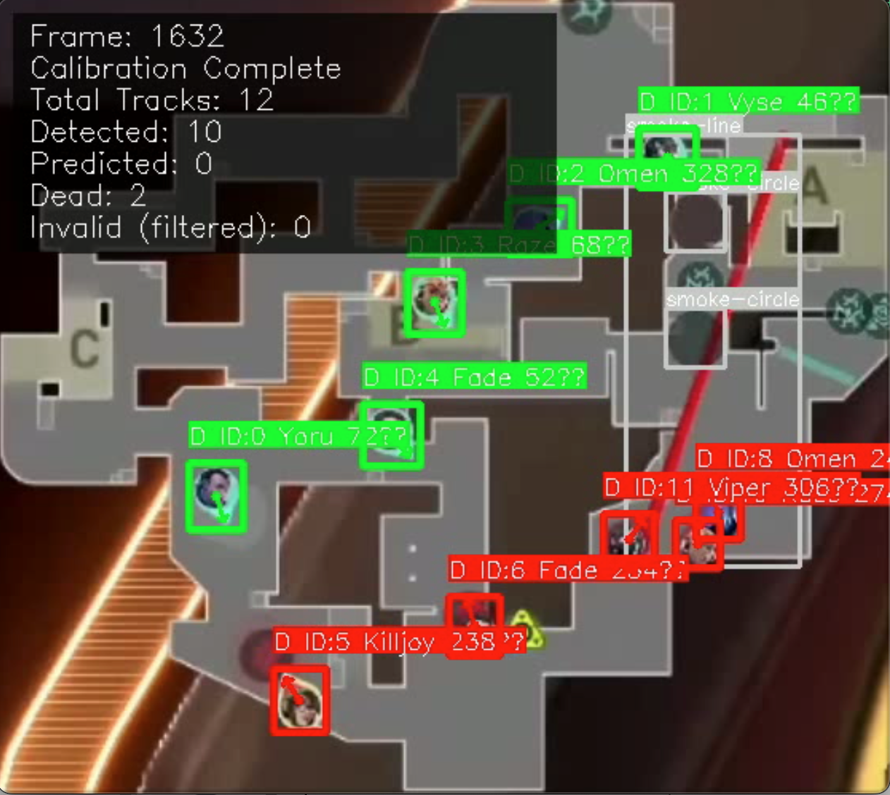
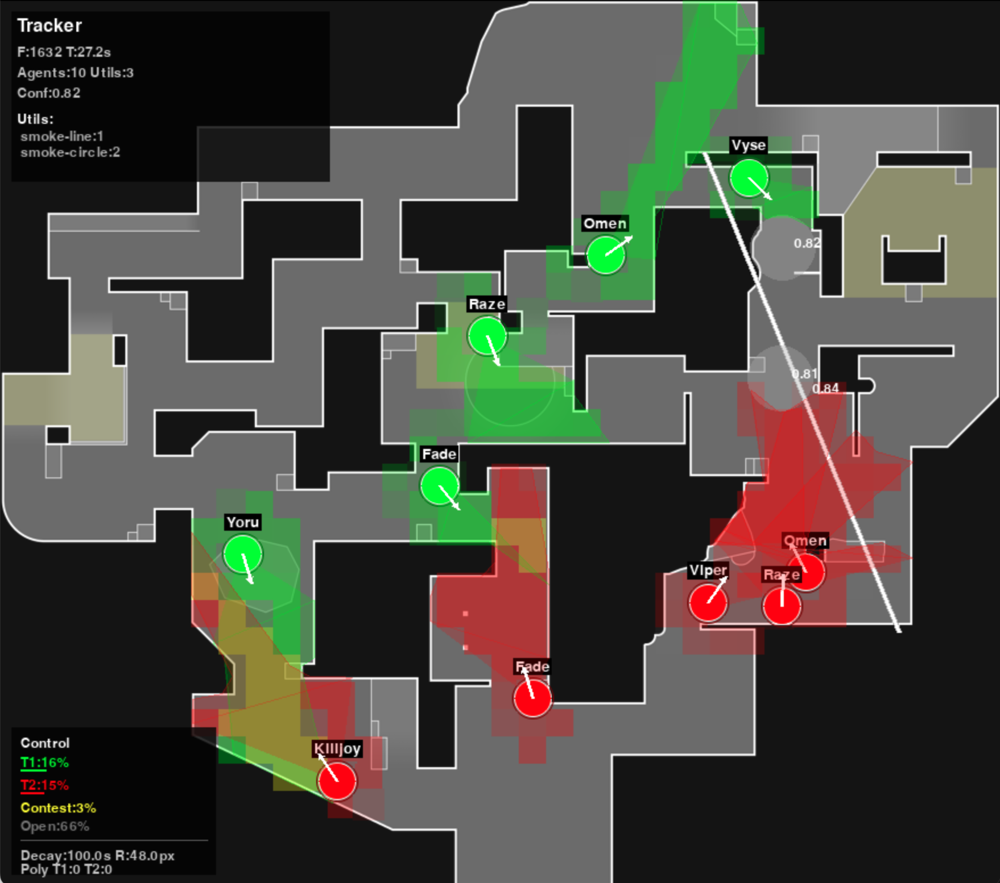

# Valorant Map Control Visualizer

A computer vision and machine learning system that analyzes Valorant gameplay videos to track agent movements, detect orientations, and visualize tactical map control in real-time.

## Purpose and Proof of Concept

This project serves as a proof of concept for automated tactical analysis in competitive gaming. It demonstrates how computer vision techniques can be applied to extract meaningful strategic insights from gameplay footage, including:

- Real-time agent detection and classification
- Orientation and line-of-sight analysis  
- Dynamic map control visualization
- Team positioning and tactical patterns

The system combines YOLO object detection with custom CNN classifiers to achieve enhanced accuracy in agent identification.

**Note** This program only visualizes PLAYER vision, it doesn't take into account utility vision(trips, turrets, cameras).




## Features

- **Agent Detection & Classification**: Uses YOLO + CNN models to identify and classify all 10 Valorant agents
- **Orientation Analysis**: Predicts agent viewing angles and creates vision cones
- **Map Control Visualization**: Real-time calculation and visualization of team map control
- **Collision-Aware Analysis**: Respects map geometry and height levels for accurate control calculations
- **Motion Prediction**: Handles occlusions and missed detections through intelligent prediction
- **Cloud Processing**: Supports Modal for remote GPU-accelerated processing

## Installation

### Prerequisites
- Python 3.13+
- CUDA-compatible GPU (recommended)
- 8GB+ RAM

### Setup

#### Option 1: Download Zip File
```bash
# Download and extract the project zip file
# Extract val_map_control.zip to your desired location
unzip val_map_control.zip
cd val_map_control

# Install dependencies
pip install -r requirements.txt
cd src
```

#### Option 2: Clone Repository
```bash
# Clone the repository
gh repo clone joshuah04/ValMapControl
cd val_map_control

# Install dependencies
pip install -r requirements.txt
cd src
```

## Usage

### Local Processing
```bash
# Basic video tracking
python3 val_tracker.py

# Visualization with map overlay
python3 val_track_visualizer.py --json track_output/tracked_data.json --minimap maps/lotus.png --map-name lotus

# Setup map collision boundaries
python3 setup_map_perimeters.py
```

**Note**: Change video path in line 956 in val_tracker.py

### Cloud Processing (Recommended)
For faster processing with GPU acceleration:

**Modal Setup**: The launcher uses Modal for cloud processing for faster processing.
- Get started: [modal guide](https://modal.com/docs/guide#getting-started)
- Create volume:
```bash
modal volume create VOLUME_NAME
```
- Upload files to volume:
```bash
modal volume put VOLUME_NAME ./ml_models
modal volume put VOLUME_NAME ./models
modal volume put VOLUME_NAME ./input_files --force
modal volume put VOLUME_NAME ./tracker --force
modal volume put VOLUME_NAME ./track_output --force
modal volume put VOLUME_NAME ./val_tracker.py --force
modal volume put VOLUME_NAME ./launcher.py --force
```
- Run command:
```bash
modal run launcher.py
```
- Download output files:
```bash
modal volume get VOLUME_NAME ./track_output --force
```
**Note**: Remember to upload val_tracker.py and launcher.py with your file paths and volume name

## Project Structure

### Core Components
- **val_tracker.py**: Main video processing pipeline coordinating all detection systems
- **val_track_visualizer.py**: Advanced visualization with vision cones and map integration

### Key Directories
- `models/`: Pre-trained ML models (YOLO, CNNs)
- `maps/`: Map images and collision configuration files
- `ml_models/`: CNN model architectures
- `tracker/`: Motion prediction and agent grouping systems
- `visualizer/`: Collision detection and grid control systems
- `input_files/`: Input video files
- `track_output/`: Generated tracking data and visualized videos

### Configuration Files
Map collision configurations are stored in `maps/collision_configs/` using native map coordinates with height area definitions.

## Map Areas and Height System

The system uses a sophisticated height-based collision detection system:

- **Height Levels**: 0=Floor, 1=Low, 2=Mid, 3=High, 4=Ceiling
- **Collision Boundaries**: Defined in native map pixel coordinates
- **Vision Calculation**: Respects map geometry for accurate line-of-sight analysis

**Important**: Map perimeter detection is not 100% accurate and may require manual adjustment for optimal results.

## Performance Warnings

- **Processing Speed**: Video analysis is computationally intensive and may be slow on CPU-only systems
- **GPU Recommended**: CUDA-compatible GPU significantly improves processing times
- **Memory Usage**: Large videos may require substantial RAM (8GB+ recommended)
- **Model Loading**: Initial model loading takes time; subsequent frames process faster

## Known Limitations

- Smoke line detection requires improvement (consider using masking techniques)
- Player area control calculations may extend through walls in some cases
- Vision-blocked areas are not always properly excluded from control calculations
- Map boundary detection requires manual verification for accuracy
- Only one video may be processed at a time

## Future Improvements

- Better AI detection
- Improve smoke line detection with masking techniques
- Implement wall-aware player control calculations
- Add vision occlusion detection for more accurate control maps
- Develop web application interface
- Support batch processing of multiple videos
- Optimize JSON data compression for smaller output files
- Enhance real-time processing capabilities
- Include batch processing for videos
